<p align="center">
  
</p>

<h1 align="center">Argus</h1>

<p align="center">
  Um canvas infinito para acompanhar todos os seus projetos e as conversas do Claude Code ao mesmo tempo.
</p>

<p align="center">
  <a href="https://github.com/ffernandomoraes/argus/releases/latest"><b>Baixar para macOS (Apple Silicon)</b></a>
  -
  <a href="https://github.com/ffernandomoraes/argus/releases/latest"><b>Baixar para Windows</b></a>
</p>



Na mitologia grega, Argus era o gigante de cem olhos que via tudo ao mesmo tempo. O app faz
o mesmo com os seus agentes: cada pasta de projeto vira um bloco no canvas e, dentro dele,
você vê as conversas do Claude Code, o que cada uma está fazendo agora e quais estão
esperando por você.

> As imagens deste README são ilustrações do app, não prints.

## Por que usar

- **Vários agentes, uma tela só.** Em vez de dez abas de terminal, cada projeto é um bloco com as
  conversas dele. Bate o olho e sabe o que está rodando, o que terminou e o que parou esperando você.
- **Nada fica parado sem você saber.** Notificação do sistema, ícone na barra de menus e a cor de
  cada conversa avisam quando o Claude termina ou precisa de uma resposta.
- **Responde sem trocar de contexto.** Aprova comandos, responde perguntas e lê o diff de cada
  edição no próprio chat, sem voltar ao terminal.
- **Do pedido à tela pronta.** No modo design, você vê a página do projeto rodando, comenta em
  cima dela e o Claude ajusta o código de verdade, não um mockup à parte.
- **Trabalho e pessoal separados.** Cada grupo usa a conta do Claude que você escolher, com o
  limite de uso de cada uma à vista.
- **Usa o que você já tem.** Roda o `claude` da sua máquina com a sua assinatura. Sem chave de API,
  sem servidor no meio.

## O que dá para fazer

### Organizar todos os projetos num canvas

Cada pasta vira um bloco com a branch do git, os arquivos não comitados e as conversas mais
recentes. Agrupe por contexto (Trabalho, Freela, Pessoal), deixe notas soltas como os
comentários do Figma, abra terminais ao lado e peça para o Claude arrumar o canvas por texto
ou voz: "cria um grupo Freela com essas duas pastas".

### Conversar com o Claude Code onde preferir

O chat completo abre no painel lateral, numa janela própria ou como um bloco no canvas. Ele
mostra o que o Claude está fazendo agora, o diff de cada arquivo editado, os pedidos de
permissão e o quanto da janela de contexto já foi usada. Os subagentes aparecem embaixo da
conversa que os lançou, com o que cada um está fazendo.

### Prototipar no código do projeto



O modo design abre a página do servidor do projeto dentro do Argus, com o chat ao lado. Comece
do zero (descreva a tela e o Claude cria) ou a partir de uma tela que já existe. Clique em
qualquer ponto da página para deixar um comentário; eles vão juntos no próximo envio, com o
endereço e um retrato em texto do que está na tela. Alterne entre desktop e celular, e em
projetos com vários apps (site, admin, app) escolha qual deles abrir.

### Saber o que precisa de você


O ícone na barra de menus resume tudo o que está rodando. As notificações chegam quando uma
conversa termina, pede permissão ou faz uma pergunta. O limite de uso aparece por conta, e a
lista de servidores locais mostra o que os agentes deixaram rodando, com atalho para abrir ou
encerrar.

### Ter as ferramentas do dia a dia por perto



Explorador de arquivos e editor com as cores do git, terminais embutidos, botão para iniciar o
servidor do projeto, biblioteca de agentes (chamados com `@nome` em qualquer conversa) e o
editor da memória do Claude.

## Funcionalidades

**Canvas**
- Canvas infinito com zoom e grupos coloridos (Trabalho, Pessoal, o que você quiser).
- Minimapa com cada bloco na cor do seu grupo e a lista dos grupos em ordem alfabética: um clique leva direto a cada um.
- Grupos: arraste blocos para dentro, renomeie com dois cliques no nome, recolha ou oculte o conteúdo.
- **Organizar board** e **Organizar grupo**, pelo botão direito: alinham os blocos e encolhem os grupos para caber o que têm dentro.
- Cada pasta de projeto vira um bloco com a branch do git e as conversas mais recentes; as demais ficam em **Ver todas as conversas**, separadas por dia. Dá para recolher a lista e deixar só as que estão rodando.
- Selo da branch com o número de arquivos não comitados: um clique lista os arquivos e abre o diff.
- Pasta com conversa rodando mostra linhas de código sendo escritas no lugar do carregando.
- Notas no canvas, como os comentários do Figma: tecla C com o mouse no canvas ou botão direito. Delete apaga e ⌘Z traz de volta.
- Botão direito na pasta: nova conversa, novo design, abrir o repositório no GitHub (ou no host do remoto) e tirar do canvas, que avisa antes se houver conversa em andamento.
- Blocos se encaixam pela borda ou pelo meio dos vizinhos ao arrastar, e ⌘Z / ⇧⌘Z (Ctrl+Z / Ctrl+Shift+Z no Windows) desfazem e refazem o layout.
- Nova janela do canvas (⇧⌘N, ou Ctrl+Shift+N no Windows) para levar a outro monitor; as janelas reabrem no mesmo lugar e o desfazer vale para todas.
- ⌘\ (Ctrl+\ no Windows) esconde as barras e deixa só o canvas.
- O layout fica salvo e volta igual ao reabrir o app.
- Comando `argus .` no terminal: abre a pasta atual no canvas, como o `code .` do VS Code.
- Barra de comando por texto ou voz: peça "cria um grupo Freela com essas duas pastas" e o Claude organiza o canvas.
- Uma conta do Claude por grupo: a pessoal num grupo, a da empresa em outro. Pastas, terminais e conversas do grupo usam a conta dele.

**Conversas com o Claude Code**
- Chat completo, com respostas em tempo real, onde você preferir: painel lateral, janela própria ou um bloco dentro do canvas.
- **Fixar** uma conversa no painel e abrir outra ao lado, sem cobrir a fixada.
- Modo foco: o painel ocupa a tela e a conversa fica numa coluna central, mais fácil de ler.
- Enquanto responde, o chat mostra o que o Claude está fazendo (pensando, escrevendo, rodando uma ferramenta) e o tempo total do turno.
- Conversa sem projeto, pelo botão direito do canvas: roda na sua pasta pessoal e vira um card no primeiro envio.
- Cole prints com ⌘V (Ctrl+V no Windows), anexe arquivos e dite em vez de digitar. A caixa começa com uma linha e cresce até três.
- Edições aparecem como diff (o antes e depois de cada arquivo).
- Aprove ou negue permissões e responda às perguntas do Claude direto no chat, na cor do grupo da pasta.
- Troque modelo, nível de esforço, thinking, Ultracode (vários subagentes em paralelo) e modo de permissão por conversa; cada conversa guarda os dela. Thinking e Ultracode começam desligados.
- Comandos de barra (`/`), `@nome` para chamar um agente, painel de servidores MCP e remote control.
- Anel com o quanto da janela de contexto a conversa já ocupa, em vermelho mais forte conforme ela enche.
- Também enxerga as sessões abertas fora do app (terminal, VS Code) e o status delas.
- Conversa que não serve mais vai para a Lixeira pelo botão direito.

**Modo design**
- Protótipo no código do projeto, pelo "+" da pasta (**Novo design**): do zero, descrevendo a tela, ou a partir de uma tela que já existe.
- A página do servidor do projeto abre dentro do app, com o chat numa coluna ao lado (dá para arrastar a divisória).
- **Comentar**: clique num ponto da página e deixe um balão preso ao elemento. Os comentários vão juntos no próximo envio, com o caminho do elemento e, em modo de desenvolvimento, o componente e o arquivo.
- Cada pedido leva o endereço, a visão (desktop ou celular) e um retrato em texto do que está na tela, sem gastar tokens com imagem.
- Desktop ou Celular, **Visualizar** (só a página, Esc sai) e ⌘R (Ctrl+R no Windows) recarrega só a página.
- Barra de endereço com a lista das rotas lidas do código do projeto.
- Projetos com vários apps no mesmo `dev` (site, admin, app): escolha qual abrir, com o nome do pacote em cada porta.
- O servidor não liga sozinho: o botão **Iniciar o servidor** fica ao lado do chat.
- Agentes globais com `@` e o status ao vivo no bloco do projeto, como numa conversa.

**Acompanhamento**
- Status de cada conversa no canvas: rodando, esperando você, concluída.
- Subagentes aparecem embaixo da conversa que os lançou enquanto trabalham, com o que estão fazendo agora.
- Notificação do sistema quando uma conversa termina ou precisa de resposta.
- Ícone na barra de menus (no Windows, na área de notificação) com o resumo do que está rodando.
- Indicador do limite de uso do Claude na barra de título, de cada conta; o detalhe abre num painel logo abaixo.
- Lista dos servidores locais que algum agente deixou rodando ou que rodam dentro das pastas do canvas, com o nome do app e atalho para abrir ou encerrar; não deixa encerrar o que derrubaria uma sessão (só no Mac).
- Fechar ou atualizar o app com conversa ou terminal rodando pede confirmação antes.

**Ferramentas**
- Terminais embutidos (Claude Code ou shell) soltos no canvas, com modo foco e ⌘+ / ⌘- (Ctrl no Windows) para a fonte.
- Botão acima da pasta para iniciar e encerrar o servidor do projeto (script `dev` ou `start` do `package.json`).
- Explorador de arquivos e editor de código do projeto: criar, renomear, excluir, colar arquivos copiados no Finder ou no Explorador de Arquivos e editar com ⌘S (Ctrl+S no Windows) para salvar. Arquivos não comitados aparecem com a cor do git; PDF, imagem, mídia e arquivo grande não abrem no editor.
- Biblioteca de agentes (subagentes do Claude Code): criação passo a passo, com o Claude preenchendo os campos a partir de uma descrição, e edição das instruções.
- Editor da memória do Claude: `CLAUDE.md` global, de cada projeto e as anotações da memória automática.

**Visual**
- No estilo do macOS: fonte do sistema (SF Pro no Mac, Segoe UI no Windows), cinzas do sistema e cantos arredondados.
- Usa a cor de destaque escolhida no Mac (Aparência) ou no Windows (Cores) e acompanha quando você troca.
- Menus translúcidos e animação suave ao abrir e fechar blocos, painéis, menus e janelas.
- Bordas do canvas esfumaçadas, para os blocos não brigarem com as barras dos cantos.
- Tema claro, escuro ou o do sistema.

**App**
- Login do Claude Code dentro do app, sem passar pelo terminal.
- Boas-vindas em 5 etapas com ilustrações; a última instala o Claude Code com um clique e faz o login.
- Configurações no estilo do Ajustes do macOS (Geral, Conversas, Aparência, Contas, Me pague um café), com as Boas-vindas sempre à mão no pé da barra lateral.
- Cada conta do Claude aparece com o nome da pessoa, a organização e o plano.
- Atualização automática, com a versão em uso no canto da barra de título e o botão de atualizar ao lado dela.
- Aba **Me pague um café** nas configurações, com QR Code e chave Pix para apoiar o projeto.

## Requisitos

- Mac com Apple Silicon (M1 ou mais novo), ou PC com Windows 10 ou 11 de 64 bits.
- [Claude Code](https://docs.claude.com/claude-code). O Argus usa o `claude` da sua máquina e a sua assinatura.
  Na primeira vez, as boas-vindas explicam o app em 5 etapas e a última configura tudo: instala o
  Claude Code com um clique (o instalador oficial da Anthropic), confere o Git no Windows e faz o
  login. Outras contas entram por
  **Configurações › Contas**.
- No Windows, também o [Git for Windows](https://git-scm.com/download/win), que o app usa para mostrar os
  arquivos alterados e o diff.

## Instalação

### macOS: pelo terminal (recomendado)

```bash
curl -fsSL https://raw.githubusercontent.com/ffernandomoraes/argus/main/install.sh | sh
```

Baixa a última versão, coloca em `/Applications` e abre. Rodar de novo atualiza.

### Atualizações

O Argus se atualiza sozinho: procura versão nova ao abrir e a cada 5 horas, e baixa em
segundo plano. Quando ela está pronta, aparece **Atualizar para x.y.z** no canto direito da
barra de título. Um clique reinicia o app já atualizado; se preferir não clicar, a versão
nova entra quando você fechar o app. Também dá para procurar na hora em
**Configurações › Geral** (no Mac, também pelo menu **Argus › Procurar atualizações…**).
No Windows, a atualização roda o instalador da versão nova em modo silencioso, sem perguntar nada.

No Mac, as permissões que você der ao app (microfone, ditado, notificações) continuam
valendo nas versões seguintes: todas saem assinadas com o mesmo certificado, e o app só
aceita uma atualização assinada por ele.

### macOS: pelo .dmg

1. Baixe o `Argus-<versão>-arm64.dmg` em [Releases](https://github.com/ffernandomoraes/argus/releases/latest).
2. Arraste o Argus para a pasta Aplicativos.
3. Na primeira vez, o macOS bloqueia a abertura, porque o app não é notarizado pela Apple.
   Vá em **Ajustes do Sistema › Privacidade e Segurança** e clique em **Abrir Mesmo Assim**.

### Windows

1. Baixe o `Argus-Setup-<versão>.exe` em [Releases](https://github.com/ffernandomoraes/argus/releases/latest).
2. Abra o arquivo. Na primeira vez, o Windows mostra **O Windows protegeu o computador**, porque
   o app não tem certificado pago de assinatura: clique em **Mais informações › Executar assim mesmo**.
3. O Argus instala na sua pasta de usuário, sem pedir administrador, cria atalhos no Menu Iniciar e
   na Área de Trabalho e abre.

No Windows o app funciona como no Mac, com duas diferenças: não há a lista de servidores que os
agentes deixaram rodando (o Windows não deixa um programa ler as variáveis de outro), e o ditado
usa só a transcrição do Claude, sem a reserva do reconhecimento de fala do macOS. Os terminais
abrem no PowerShell.

### Comando `argus`

Em **Configurações › Geral**, ative o comando `argus` no terminal. Depois, em qualquer pasta:

```bash
argus .
```

No Windows ele funciona no PowerShell e no Prompt de Comando. Se a pasta
`%USERPROFILE%\.local\bin` não estiver no PATH, o Argus a acrescenta ao ativar o comando.

## Desenvolvimento

```bash
pnpm install   # também compila o ditado (precisa das Command Line Tools da Apple)
pnpm dev       # abre o app com recarga automática
pnpm typecheck
pnpm dist      # gera o .dmg e o .zip em dist/
pnpm dist:win  # gera o instalador do Windows em dist/ (rode num Windows: no Mac falta o ícone do .exe)
```

A versão de desenvolvimento usa uma pasta de dados própria (`Argus Dev`) e um comando
`argus` próprio, então roda ao lado da instalada sem mexer nela.

Rodando de dentro do VS Code ou do Claude Code, a variável `ELECTRON_RUN_AS_NODE` pode
vir ligada e o Electron abre como Node, sem janela. Nesse caso:

```bash
env -u ELECTRON_RUN_AS_NODE pnpm dev
```

Stack: Electron, React, TypeScript, electron-vite, React Flow, Tailwind, CodeMirror,
xterm.js com node-pty e o [Claude Agent SDK](https://docs.claude.com/en/api/agent-sdk/overview)
(rodando o `claude` da máquina, ver [docs/integracao-com-agentes.md](docs/integracao-com-agentes.md)).

As ilustrações deste README (`docs/ilustracoes/*.svg`) saem de um script, não de prints, e
trocam sozinhas entre claro e escuro conforme o tema do GitHub. Para mudar alguma, edite o
script e rode:

```bash
python3 scripts/gerar-ilustracoes.py
```

### Gerar uma versão

Todo push na `main` vira uma versão: o workflow **Release** sobe o patch no `package.json`,
cria a tag, monta o `.dmg` e o `.zip`, publica o release e usa os títulos dos commits desde
a última versão como notas. Em seguida, numa máquina Windows do GitHub, monta o instalador
`.exe`, abre o app em modo de teste (`--smoke-test`) e, se ele subir, anexa o instalador ao
mesmo release. Pushes que só mexem em `.md` não geram versão. Como os títulos
viram as notas, escreva-os para quem usa o app.

Para subir minor ou major, ou escrever as notas à mão, dispare pela aba
**Actions › Release › Run workflow** ou:

```bash
gh workflow run release.yml -f bump=minor -f notas="- item 1
- item 2"
```

Com `publicar` desmarcado, o workflow só monta o app e guarda o `.dmg` e o `.exe` no run,
sem tag nem release.

A assinatura usa o certificado autoassinado guardado nos secrets do repositório
(`MAC_CERT_P12`, `MAC_CERT_PASSWORD`, `MAC_SIGN_IDENTITY`). Sem eles, o app sai com
assinatura ad-hoc e cada versão conta como um app novo para o macOS, que volta a pedir
microfone e ditado.

## Documentos

| Arquivo | O que tem |
|---|---|
| [docs/visao.md](docs/visao.md) | Problema, ideia, princípios e o pedido original |
| [docs/conceitos.md](docs/conceitos.md) | Vocabulário do produto: grupo, pasta, conversa, terminal, agente, conta |
| [docs/funcionalidades.md](docs/funcionalidades.md) | O que foi planejado por fase, o que já existe e o que falta |
| [docs/integracao-com-agentes.md](docs/integracao-com-agentes.md) | Como o app conversa com o Claude e o que ele lê do Claude Code |
| [docs/decisoes.md](docs/decisoes.md) | O que já foi decidido e o que está em aberto |

---

Projeto pessoal, sem vínculo com a Anthropic. Claude e Claude Code são marcas da Anthropic.
