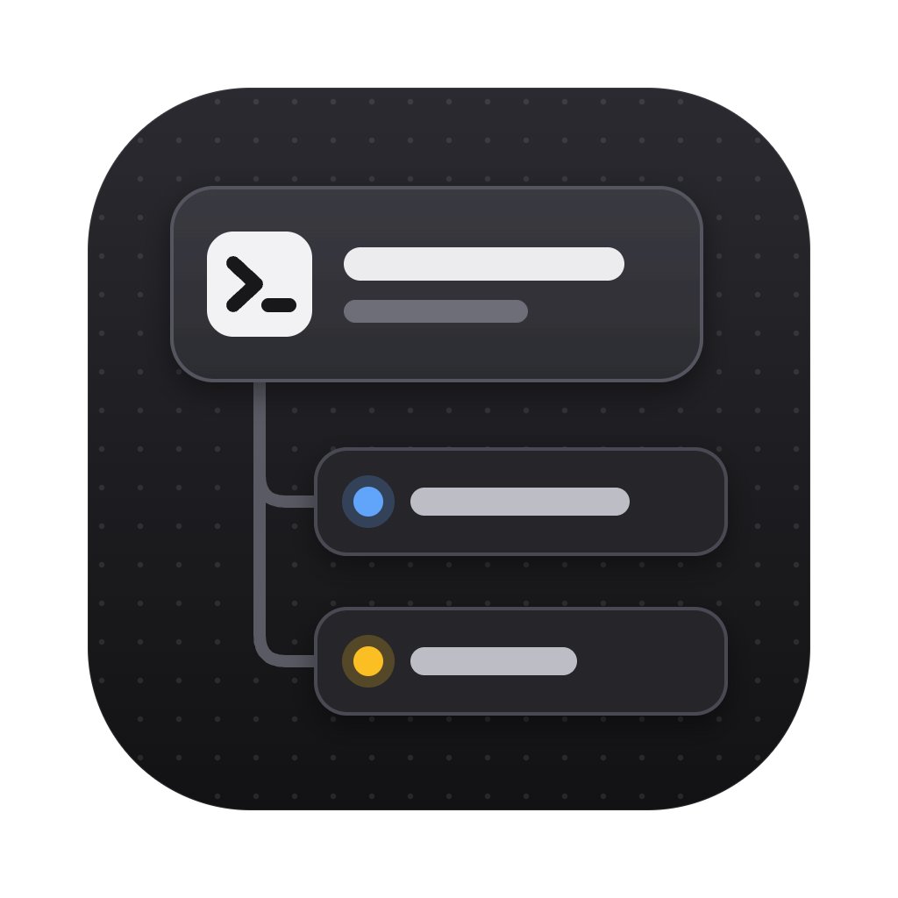
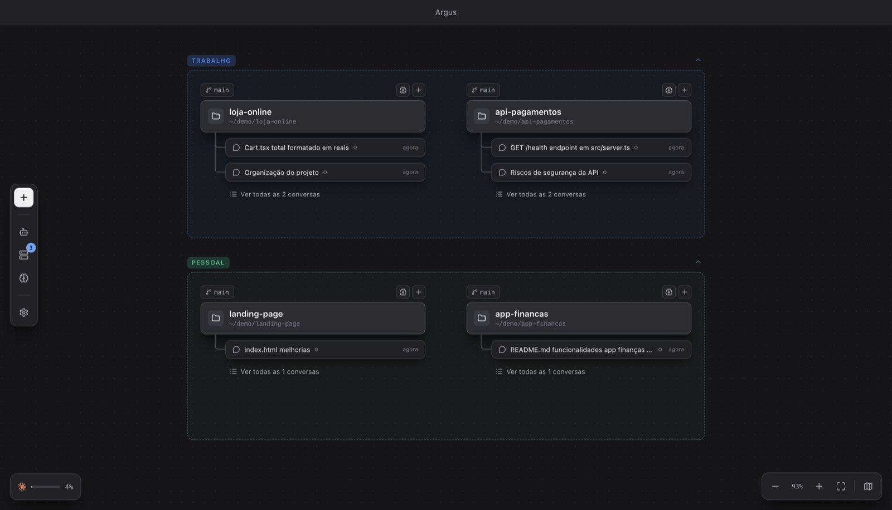
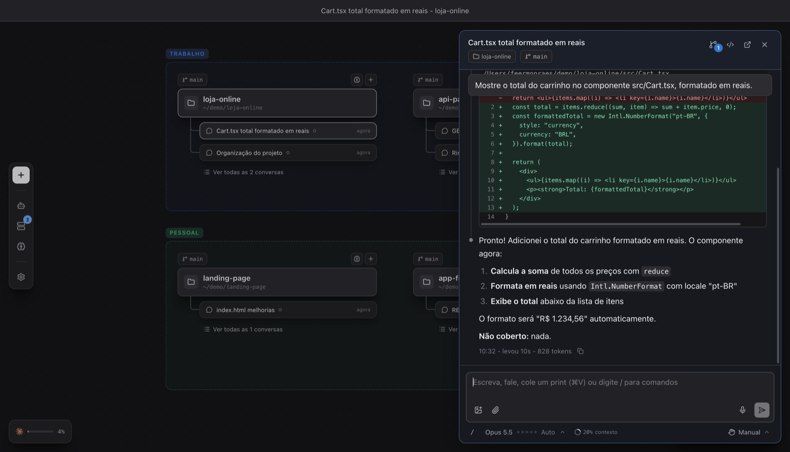

<p align="center">
  
</p>

<h1 align="center">Argus</h1>

<p align="center">
  Um canvas infinito para acompanhar todos os seus projetos e as conversas do Claude Code ao mesmo tempo.
</p>

<p align="center">
  <a href="https://github.com/ffernandomoraes/argus/releases/latest"><b>Baixar para macOS (Apple Silicon)</b></a>
</p>



Na mitologia grega, Argus era o gigante de cem olhos que via tudo ao mesmo tempo. O app faz
o mesmo com os seus agentes: cada pasta de projeto vira um bloco no canvas e, dentro dele,
você vê as conversas do Claude Code, o que cada uma está fazendo agora e quais estão
esperando por você.



## Funcionalidades

**Canvas**
- Canvas infinito com zoom, minimapa e grupos coloridos (Trabalho, Pessoal, o que você quiser).
- Grupos: arraste blocos para dentro, renomeie com dois cliques no nome, recolha ou oculte o conteúdo.
- Cada pasta de projeto vira um bloco com a branch do git e as conversas mais recentes; as demais ficam em **Ver todas as conversas**. Dá para recolher a lista e deixar só as que estão rodando.
- Blocos se encaixam pela borda ou pelo meio dos vizinhos ao arrastar, e ⌘Z / ⇧⌘Z desfazem e refazem o layout.
- O layout fica salvo e volta igual ao reabrir o app.
- Comando `argus .` no terminal: abre a pasta atual no canvas, como o `code .` do VS Code.
- Barra de comando por texto ou voz: peça "cria um grupo Freela com essas duas pastas" e o Claude organiza o canvas.
- Uma conta do Claude por grupo: a pessoal num grupo, a da empresa em outro. Pastas, terminais e conversas do grupo usam a conta dele.

**Conversas com o Claude Code**
- Chat completo, com respostas em tempo real, onde você preferir: painel lateral, janela própria ou um bloco dentro do canvas.
- Conversa sem projeto, pelo botão direito do canvas: roda na sua pasta pessoal e vira um card no primeiro envio.
- Cole prints com ⌘V, anexe arquivos e dite em vez de digitar.
- Edições aparecem como diff (o antes e depois de cada arquivo).
- Aprove ou negue permissões e responda às perguntas do Claude direto no chat.
- Troque modelo, nível de esforço, thinking e modo de permissão por conversa; cada conversa guarda os dela.
- Comandos de barra (`/`), `@nome` para chamar um agente, painel de servidores MCP e remote control.
- Anel com o quanto da janela de contexto a conversa já ocupa.
- Também enxerga as sessões abertas fora do app (terminal, VS Code) e o status delas.

**Acompanhamento**
- Status de cada conversa no canvas: rodando, esperando você, concluída.
- Subagentes aparecem embaixo da conversa que os lançou enquanto trabalham, com o que estão fazendo agora.
- Notificação do sistema quando uma conversa termina ou precisa de resposta.
- Ícone na barra de menus com o resumo do que está rodando.
- Indicador do limite de uso do Claude, de cada conta.
- Lista dos servidores locais que algum agente deixou rodando, com atalho para abrir ou encerrar.
- Fechar ou atualizar o app com conversa ou terminal rodando pede confirmação antes.

**Ferramentas**
- Terminais embutidos (Claude Code ou shell) soltos no canvas.
- Botão acima da pasta para iniciar e encerrar o servidor do projeto (script `dev` ou `start` do `package.json`).
- Explorador de arquivos e editor de código do projeto: criar, renomear, excluir, colar arquivos copiados no Finder e editar com ⌘S para salvar. Arquivos não comitados aparecem com a cor do git.
- Biblioteca de agentes (subagentes do Claude Code): criar, editar e deixar o Claude escrever as instruções.
- Editor da memória do Claude: `CLAUDE.md` global, de cada projeto e as anotações da memória automática.

**App**
- Login do Claude Code dentro do app, sem passar pelo terminal.
- Tema claro, escuro ou o do sistema.
- Atualização automática, com a versão em uso sempre no canto da barra de título.

## Requisitos

- Mac com Apple Silicon (M1 ou mais novo).
- [Claude Code](https://docs.claude.com/claude-code) instalado. O Argus usa o `claude` da sua máquina e a sua assinatura.
  Sem login, o app abre numa tela para entrar na conta. Outras contas entram por
  **Configurações › Contas**.

## Instalação

### Pelo terminal (recomendado)

```bash
curl -fsSL https://raw.githubusercontent.com/ffernandomoraes/argus/main/install.sh | sh
```

Baixa a última versão, coloca em `/Applications` e abre. Rodar de novo atualiza.

### Atualizações

O Argus se atualiza sozinho: procura versão nova ao abrir e a cada 5 horas, e baixa em
segundo plano. Quando ela está pronta, aparece **Atualizar para x.y.z** no canto direito da
barra de título. Um clique reinicia o app já atualizado; se preferir não clicar, a versão
nova entra quando você fechar o app. Também dá para procurar na hora pelo menu
**Argus › Procurar atualizações…** ou em **Configurações › Geral**.

As permissões que você der ao app (microfone, ditado, notificações) continuam valendo nas
versões seguintes: todas saem assinadas com o mesmo certificado, e o app só aceita uma
atualização assinada por ele.

### Pelo .dmg

1. Baixe o `Argus-<versão>-arm64.dmg` em [Releases](https://github.com/ffernandomoraes/argus/releases/latest).
2. Arraste o Argus para a pasta Aplicativos.
3. Na primeira vez, o macOS bloqueia a abertura, porque o app não é notarizado pela Apple.
   Vá em **Ajustes do Sistema › Privacidade e Segurança** e clique em **Abrir Mesmo Assim**.

### Comando `argus`

Em **Configurações › Geral**, ative o comando `argus` no terminal. Depois, em qualquer pasta:

```bash
argus .
```

## Desenvolvimento

```bash
pnpm install   # também compila o ditado (precisa das Command Line Tools da Apple)
pnpm dev       # abre o app com recarga automática
pnpm typecheck
pnpm dist      # gera o .dmg e o .zip em dist/
```

A versão de desenvolvimento usa uma pasta de dados própria (`Argus Dev`) e um comando
`argus` próprio, então roda ao lado da instalada sem mexer nela.

Rodando de dentro do VS Code ou do Claude Code, a variável `ELECTRON_RUN_AS_NODE` pode
vir ligada e o Electron abre como Node, sem janela. Nesse caso:

```bash
env -u ELECTRON_RUN_AS_NODE pnpm dev
```

Stack: Electron, React, TypeScript, electron-vite, React Flow, Tailwind, CodeMirror,
xterm.js com node-pty e o [Claude Agent SDK](https://docs.claude.com/en/api/agent-sdk/overview)
(rodando o `claude` da máquina, ver [docs/integracao-com-agentes.md](docs/integracao-com-agentes.md)).

### Gerar uma versão

Todo push na `main` vira uma versão: o workflow **Release** sobe o patch no `package.json`,
cria a tag, monta o `.dmg` e o `.zip`, publica o release e usa os títulos dos commits desde
a última versão como notas. Pushes que só mexem em `.md` não geram versão. Como os títulos
viram as notas, escreva-os para quem usa o app.

Para subir minor ou major, ou escrever as notas à mão, dispare pela aba
**Actions › Release › Run workflow** ou:

```bash
gh workflow run release.yml -f bump=minor -f notas="- item 1
- item 2"
```

Com `publicar` desmarcado, o workflow só monta o app e guarda o `.dmg` no run, sem tag nem
release.

A assinatura usa o certificado autoassinado guardado nos secrets do repositório
(`MAC_CERT_P12`, `MAC_CERT_PASSWORD`, `MAC_SIGN_IDENTITY`). Sem eles, o app sai com
assinatura ad-hoc e cada versão conta como um app novo para o macOS, que volta a pedir
microfone e ditado.

## Documentos

| Arquivo | O que tem |
|---|---|
| [docs/visao.md](docs/visao.md) | Problema, ideia, princípios e o pedido original |
| [docs/conceitos.md](docs/conceitos.md) | Vocabulário do produto: grupo, pasta, conversa, terminal, agente, conta |
| [docs/funcionalidades.md](docs/funcionalidades.md) | O que foi planejado por fase, o que já existe e o que falta |
| [docs/integracao-com-agentes.md](docs/integracao-com-agentes.md) | Como o app conversa com o Claude e o que ele lê do Claude Code |
| [docs/decisoes.md](docs/decisoes.md) | O que já foi decidido e o que está em aberto |

---

Projeto pessoal, sem vínculo com a Anthropic. Claude e Claude Code são marcas da Anthropic.
